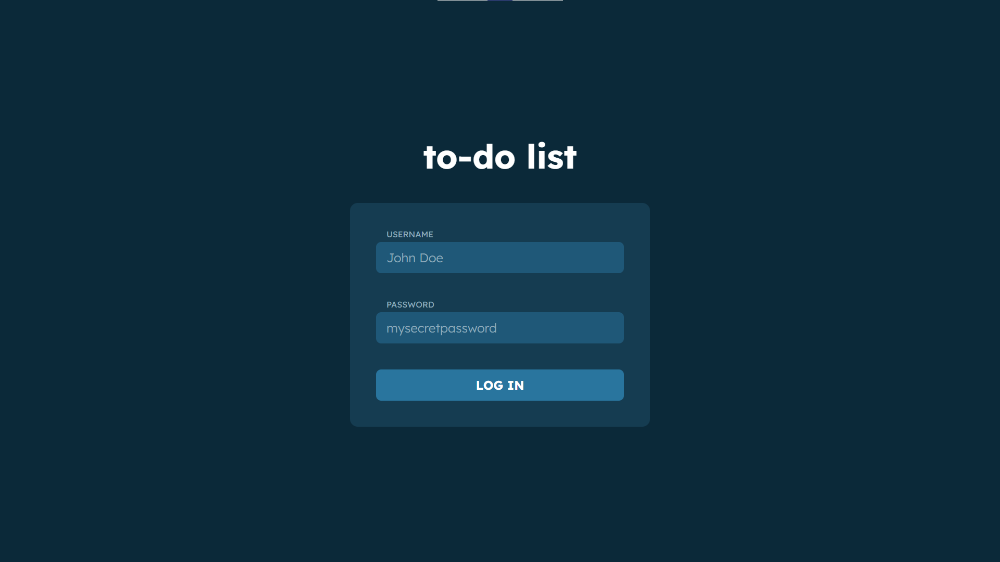
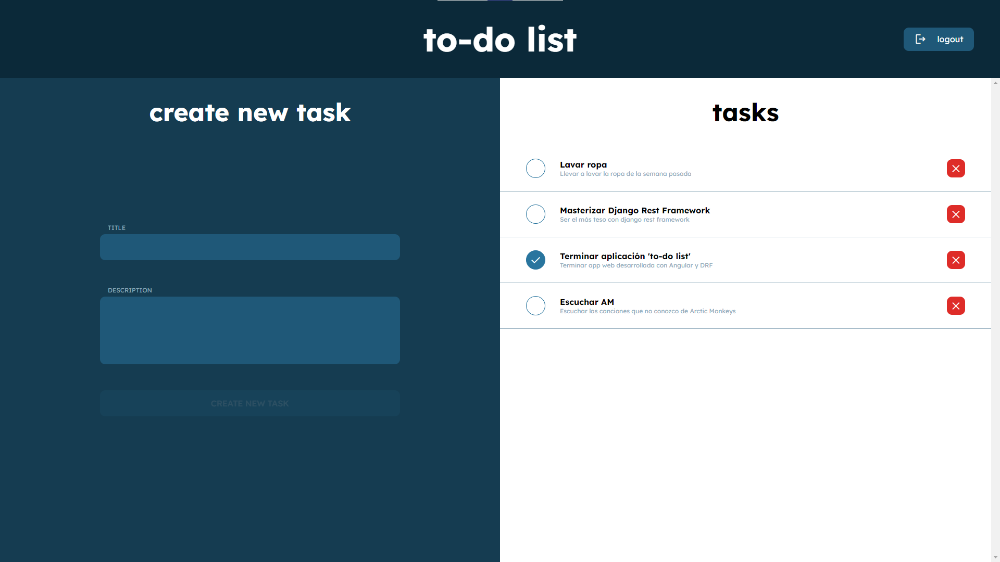
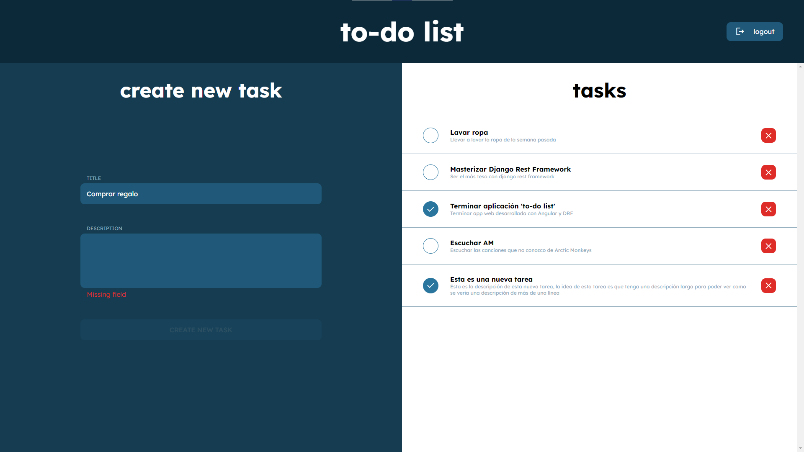
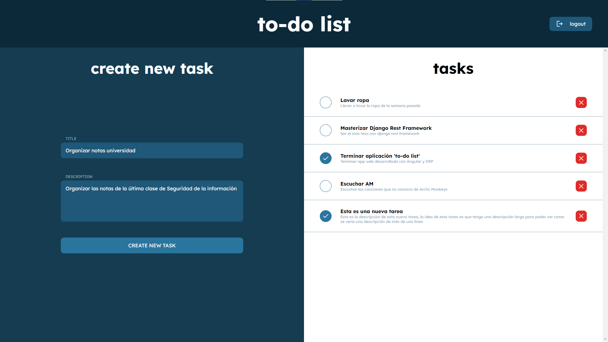
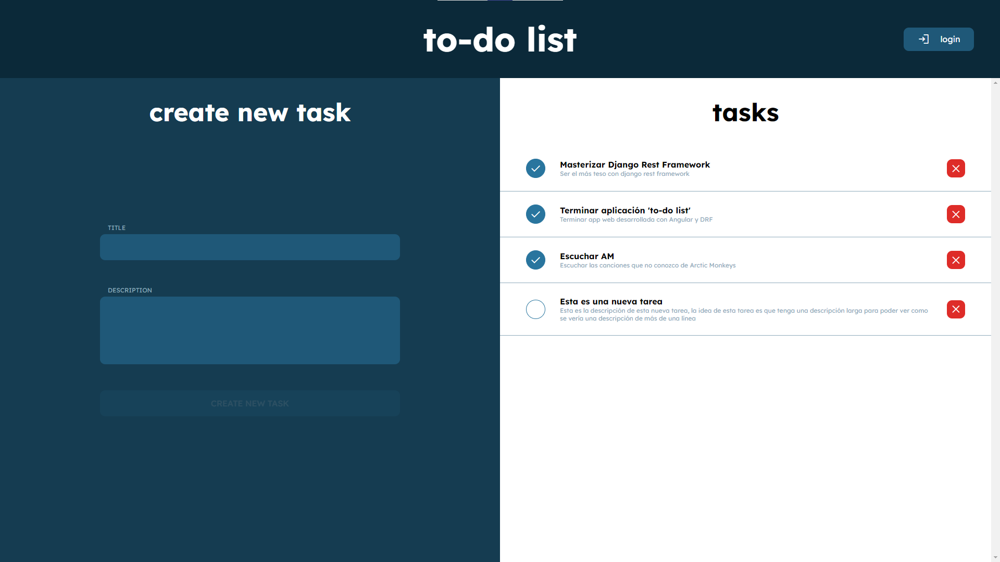

# **To-do list** 📋

To-Do list web application created using the following web-dev stack:

**Angular** was used as the front-end framework to request the data from the back-end framework via REST, also Angular was used along side **TypeScript**, **RxJS** and **SASS**.

**Django** was used as the back-end framwork, as a RESTful API, receiving requests from the front-end, connecting to the **PostgreSQL** database and then replying to the front-end with data. **Django REST framework** was used to create the data models, serializers, permissions and endpoints.

# **Some images of the app**

## **Login**

## **Tasks**
Main view of the app, on the left, there is a form where new tasks can be created, and on the right, there are the already existing tasks.

## **Create new task (Incomplete form)**
If you try to create a task, you must fill both text fields, or the form won't let you create a new task.

## **Create new task (Valid form)**
Here the button is no longer disabled and you can create a new task.

## **Modified and deleted tasks**
You can modify the completion state of tasks, and you can also delete already existing tasks

# **How to install**
You need the following dependencies to run this app:
* Python
* Node.js
* Angular
* PostgreSQL
* Docker (optional)

First you must have Python in your computer, this is required for using the django backend, you can have it [locally](https://www.python.org/downloads/) or in [docker](https://hub.docker.com/_/python).

Python comes with a package manager called pip, with pip use the following command to install the required packages:

    pip install django djangorestframework django-cors-headers psycopg2

(You can do the previous step with a [virtual environment](https://www.dataquest.io/blog/a-complete-guide-to-python-virtual-environments/))

Then you must have Node.js installed. You can do that [here](https://nodejs.org/en).

Node.js comes with npm package manager, with that you can install angular, here's a detailed guide to that: [Angular setup](https://angular.io/guide/setup-local).

Then install postgres, I reccomend using [Docker](https://hub.docker.com/_/postgres).

Lastly, clone this repo with:

    git clone https://github.com/GabrielCornejoB/to-do-app

